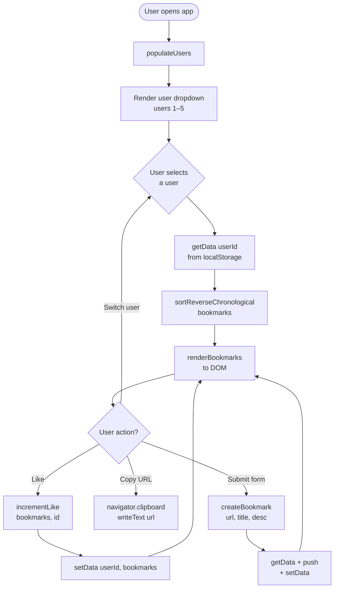
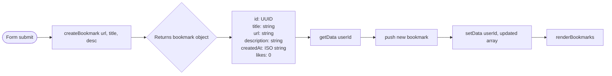

# Shared Bookmark — Application Flowchart

## Full App Flow



## Add Bookmark Flow (detail)



## Architecture Layers

```
+---------------------------+
|          UI Layer         |  index.html + script.js
|  render, events, DOM ops  |
+---------------------------+
            |
+---------------------------+
|       Logic Layer         |  bookmarks.js
|  createBookmark           |
|  sortReverseChronological |
|  incrementLike            |
+---------------------------+
            |
+---------------------------+
|      Storage Layer        |  storage.js
|  getData / setData        |
|  localStorage             |
+---------------------------+
```

## ASCII Fallback (no Mermaid)

```
[Open app]
    |
[populateUsers] --> dropdown (users 1-5)
    |
[Select user]
    |
[getData(userId)] <-- localStorage
    |
[sortReverseChronological]
    |
[renderBookmarks] --> DOM
    |
   / | \
  /  |  \
Like Copy  Add bookmark
 |    |        |
increment  clipboard  createBookmark
Like()              |
 |              getData + push + setData
setData()           |
 |             renderBookmarks
renderBookmarks
```
